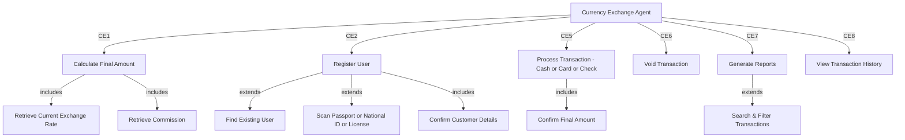
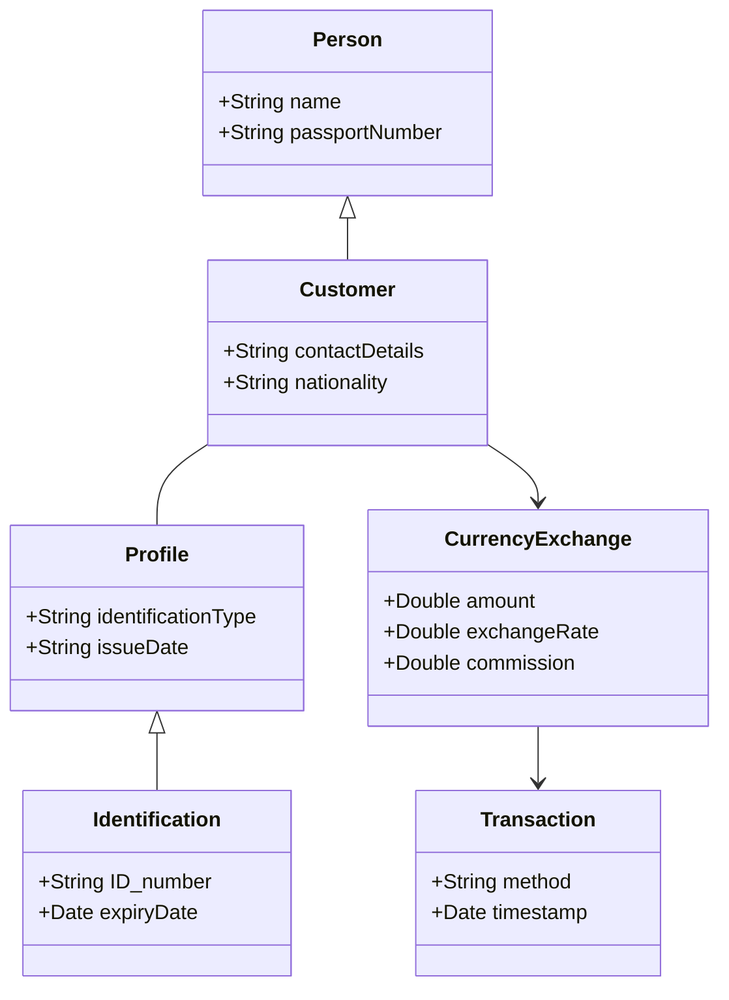
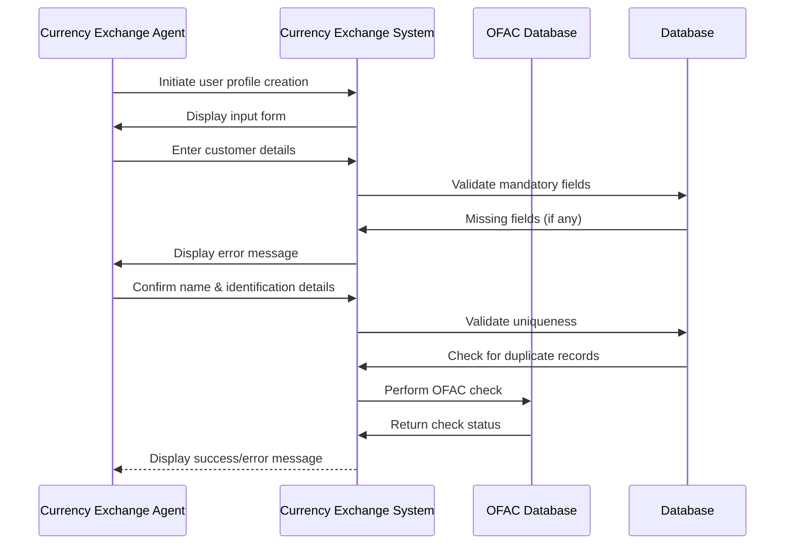

# Money Exchange System (MEXS) - System Design Documentation

## **Project Overview**

The **Money Exchange System (MEXS)** is a **financial transaction system** designed for international airports, enabling secure and compliant currency exchanges. This project focuses solely on **system design**, covering architectural decisions, business logic, and UML diagrams.

## **System Objectives**

- **Secure Authentication & Role-Based Access Control (RBAC):** Ensure only authorized users can access system functionalities.
- **Real-time Currency Exchange Management:** Dynamic exchange rate retrieval and commission calculation.
- **Regulatory Compliance:** Integrate **OFAC checks** and enforce **KYC** (Know Your Customer) requirements.
- **Transaction Tracking & Reporting:** Log exchange transactions and generate **daily/monthly reports**.

---

## **System Architecture**

The architecture is designed for **scalability, security, and compliance**, consisting of:

- **Authentication Layer:** Secure user login with **RBAC** (Admin, Manager, Exchange Agent).
- **Business Logic Layer:** Implements **exchange rate retrieval, commission calculations, and OFAC checks**.
- **Data Storage Layer:** Relational database storing **user profiles, transactions, exchange rates, and statistics**.
- **External Integrations:** Fetching **real-time exchange rates** and validating customers against the **OFAC database**.

### **High-Level System Architecture Diagram**


---

## **Use Case Diagram**

The **Use Case Diagram** highlights how the system interacts with different **users and external services**.



---

## **Class Diagram**

This **Class Diagram** illustrates the **object-oriented design** for the system.



---

## **Sequence Diagram**

The **Sequence Diagram** below demonstrates the **customer profile creation process**, including validation, uniqueness checks, and **OFAC compliance verification**.



---

## **Business Logic and Compliance**

- **Real-Time Exchange Rate Retrieval:** Fetches updated exchange rates and applies a configurable commission.
- **Transaction Processing:** Ensures **accurate calculations** for exchanged amounts based on currency and region.
- **OFAC & KYC Compliance:** Verifies **customer identity and financial status** before allowing transactions.
- **Historical Data Storage:** Archives **previous exchange rates and transactions** for reporting and analysis.

---

## **Repository Structure**

```plaintext
money-exchange-system-design/
│
├── README.md                       # Comprehensive project overview and documentation
├── diagrams/                        # UML diagrams and architectural designs
│   ├── use-case-diagram.mmd         # Mermaid file for Use Case Diagram
│   ├── class-diagram.mmd            # Mermaid file for Class Diagram
│   ├── sequence-diagram.mmd         # Mermaid file for Sequence Diagram
│   ├── architecture-diagram.png     # High-level system architecture overview
│   ├── expanded-sequence.png        # Additional sequence diagram for profile creation
└── docs/                            # Additional documentation and analysis
    ├── requirements.md              # Functional and Non-Functional Requirements
    ├── design-decisions.md          # Architectural choices and design patterns
    ├── business-logic.md            # Business rules, data flow, and compliance
    ├── system-workflow.md           # Step-by-step explanation of key processes
```

---

## **Future Enhancements**

- **Multi-Currency Support**: Enhancing exchange calculations for multi-currency transactions.
- **Fraud Detection Mechanism**: Implementing AI-driven fraud detection in compliance with global financial regulations.
- **Automated Exchange Rate Updates**: Real-time integration with global exchange rate providers.


