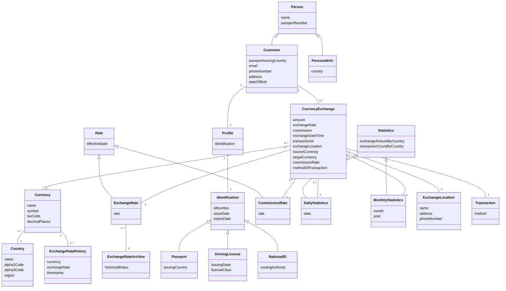

# Money Exchange System (MEXS) - System Design Documentation

## **Project Overview**

The Money Exchange System (MEXS) is a financial transaction system designed for international airports, enabling secure and compliant currency exchanges. This project focuses solely on system design, covering architectural decisions, business logic, and UML diagrams.This system design project was developed as part of the Information Systems Analysis and Design course (INFO 620). It is a group effort by a team of 5, focusing on a comprehensive Money Exchange System (MEXS) for international currency exchanges.

## **System Objectives**

- **Secure Authentication & Role-Based Access Control (RBAC):** Ensure only authorized users can access system functionalities.
- **Real-time Currency Exchange Management:** Dynamic exchange rate retrieval and commission calculation.
- **Regulatory Compliance:** Integrate **OFAC checks** and enforce **KYC** (Know Your Customer) requirements.
- **Transaction Tracking & Reporting:** Log exchange transactions and generate **daily/monthly reports**.

---

## **System Architecture**

The architecture is designed for **scalability, security, and compliance**, consisting of:

- **Authentication Layer:** Secure user login with **RBAC** (Admin, Manager, Exchange Agent).
- **Business Logic Layer:** Implements **exchange rate retrieval, commission calculations, and OFAC checks**.
- **Data Storage Layer:** Relational database storing **user profiles, transactions, exchange rates, and statistics**.
- **External Integrations:** Fetching **real-time exchange rates** and validating customers against the **OFAC database**.

---

### **High-Level System Architecture Diagram**


## **System Workflow**
The **Money Exchange System** operates through a structured workflow:
1. **User Authentication:** Admins, Managers, and Exchange Agents log in with secure credentials.
2. **Customer Registration & Verification:** Customer details are validated, and KYC/OFAC checks are performed.
3. **Currency Exchange Processing:**
   - Retrieves current exchange rate and commission.
   - Computes the final amount and records the transaction.
4. **Transaction Storage & Reporting:**
   - Transactions are logged into the database.
   - Admins generate daily/monthly reports for financial auditing.
     
---

## **Use Case Diagram**

The **Use Case Diagram** highlights how the system interacts with different **users and external services**.


---


## **Business Logic & Compliance**
The **Money Exchange System (MEXS)** ensures **secure, accurate, and compliant** currency exchange operations. The system follows strict **regulatory standards** while efficiently processing financial transactions.

### ** Transaction Processing**
- **Dynamic Exchange Rate Retrieval:**  
  - The system fetches the latest exchange rates from an **external API** before processing transactions.
  - A configurable **commission rate** is applied to determine the final exchange amount.
  
- **Currency Exchange Calculation:**  
  - Computes the **final amount** using the formula:  
    \[
    \text{Final Amount} = (\text{Exchange Rate} \times \text{Original Amount}) - \text{Commission}
    \]
  - Ensures accuracy with proper **rounding mechanisms** based on the currency's decimal precision.

- **Multi-Method Payment Processing:**  
  - Customers can complete transactions using **cash, credit card, or checks**.
  - The system tracks transaction **timestamps**, amounts, and payment methods.

### ** Regulatory Compliance Enforcement**
- **KYC (Know Your Customer) & Identity Verification:**  
  - Customers must present valid identification (**Passport, Driving License, National ID**) before initiating a transaction.
  - System **validates customer details** against stored records.

- **OFAC Sanction List Check:**  
  - Every customer is **screened in real time** against the **Office of Foreign Assets Control (OFAC) list** to ensure compliance.
  - Transactions are **blocked automatically** if a match is found.

- **Fraud Prevention Mechanisms:**  
  - Detects **suspicious transactions** (e.g., unusually large exchanges, multiple rapid transactions).
  - Logs flagged transactions for **further review** by compliance officers.

### ** Transaction Auditing & Reporting**
- **Daily and Monthly Reports:**  
  - Admins generate reports showing **total transactions, exchanged amounts, commission earned, and flagged transactions**.
  - Reports help in **financial tracking and compliance audits**.

- **Secure Data Storage:**  
  - All **transactions and customer data** are stored securely in an **encrypted database**.
  - Follows **data retention policies** for auditability.

---

## **Design Decisions**
Key architectural and design choices for **scalability and security:**
- **RBAC Implementation:** Restricts system access based on user roles.
- **Database Normalization:** Ensures data consistency and eliminates redundancy.
- **Separation of Concerns:** Divides responsibilities into authentication, business logic, and storage layers.
- **Compliance Integration:** Incorporates external APIs for **OFAC checks and real-time exchange rates**.

---


## **Class Diagram**

This **Class Diagram** illustrates the **object-oriented design** for the system.



**Class Model Definitions**

- **PersonalInfo:** Represents a person’s country information.
- **Profile:** Links customers to various forms of identification (Passport, DrivingLicense, NationalID).
- **Identification:** Abstract class representing different identification forms, characterized by ID number, issue date, and expiry date.
- **Passport:** Subclass of Identification, details issuing country.
- **DrivingLicense:** Subclass of Identification, includes issuing state and license class.
- **NationalID:** Subclass of Identification, includes issuing authority.
- **CurrencyExchange:** Represents transaction details of currency exchanges, including amount, exchange rate, commission, timestamp, and transaction ID.
- **Currency:** Represents different currencies with attributes like name, symbol, ISO code, and decimal places.
- **Rate:** Base class for ExchangeRate and CommissionRate, capturing the effective date.
- **ExchangeRate:** Subclass of Rate, storing currency exchange rates.
- **CommissionRate:** Subclass of Rate, storing commission values.
- **ExchangeRateArchive:** Keeps historical exchange rate records.
- **ExchangeRateHistory:** Stores past exchange rate data with timestamps.
- **Statistics:** Captures exchange volume and transaction count by country.
- **DailyStatistics:** Subclass of Statistics, records daily transactions.
- **MonthlyStatistics:** Subclass of Statistics, records monthly transactions.
- **Country:** Represents a country with name, alpha-2/3 codes, and region.
- **ExchangeLocation:** Stores exchange office details like name, address, and phone number.
- **Transaction:** Represents the method used for a currency exchange transaction.

---

## **Design Class Diagram**

The **Design Class Diagram** expands upon the Class Diagram by incorporating methods, relationships, and detailed behaviors of each class, ensuring a clear implementation structure.


### **Design Class Model Enhancements:**
- **Encapsulation of Attributes:** Getter and setter methods for controlled data access.
- **Inheritance & Polymorphism:** Parent classes like `Identification` extend into subclasses like `Passport`, `DrivingLicense`, and `NationalID`.
- **Composition and Associations:**
  - `Customer` **has-a** `Profile`, which **has-a** `Identification`.
  - `CurrencyExchange` **has-a** `ExchangeLocation` and involves `SourceCurrency` & `TargetCurrency`.
- **Transaction Methods:**
  - `calculateFinalAmount()` – Computes the final amount after commission.
  - `validateIdentification()` – Ensures uniqueness and compliance.
  - `generateReport()` – Aggregates statistics on daily/monthly transactions.
---

## **Sequence Diagram**

The **Sequence Diagram** below demonstrates the **customer profile creation process**, including validation, uniqueness checks, and **OFAC compliance verification**.


---


## **Future Enhancements**

- **Multi-Currency Support**: Enhancing exchange calculations for multi-currency transactions.
- **Fraud Detection Mechanism**: Implementing AI-driven fraud detection in compliance with global financial regulations.
- **Automated Exchange Rate Updates**: Real-time integration with global exchange rate providers.

---

## **Repository Structure**

```plaintext
money-exchange-system-design/
│
├── README.md                       # Comprehensive project overview and documentation
├── diagrams/                       # UML diagrams and architectural designs
│   ├── use-case-diagram.png        # file for Use Case Diagram
│   ├── class-diagram.md            # Mermaid file for Class Diagram
│   ├── design-class-diagram.md     # Mermaid file for Design Class Diagram
│   ├── architecture-diagram.png    # High-level system architecture overview
│   ├── expanded-sequence.png       # Additional sequence diagram for profile creation
└── docs/                           # Additional documentation and analysis
    ├── project-report.pdf          # Detailed report
   
```

---

