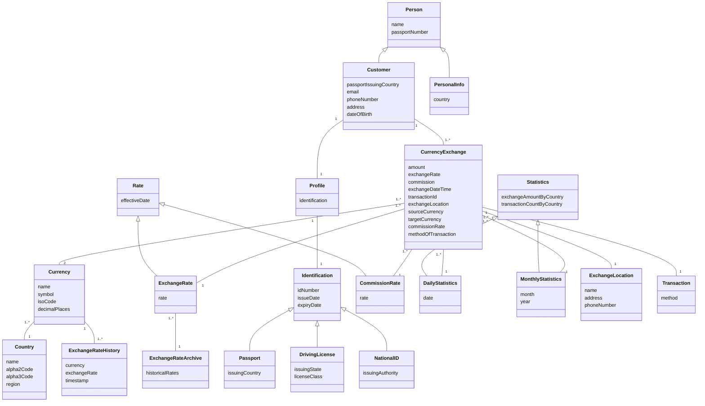

```mermaid
classDiagram
    class Person {
        name
        passportNumber
    }

    class Customer {
        passportIssuingCountry
        email
        phoneNumber
        address
        dateOfBirth
    }

    class PersonalInfo {
        country
    }

    class Profile {
        identification
    }

    class Identification {
        idNumber
        issueDate
        expiryDate
    }

    class Passport {
        issuingCountry
    }

    class DrivingLicense {
        issuingState
        licenseClass
    }

    class NationalID {
        issuingAuthority
    }

    class CurrencyExchange {
        amount
        exchangeRate
        commission
        exchangeDateTime
        transactionId
        exchangeLocation
        sourceCurrency
        targetCurrency
        commissionRate
        methodOfTransaction
    }

    class Currency {
        name
        symbol
        isoCode
        decimalPlaces
    }

    class Rate {
        effectiveDate
    }

    class ExchangeRate {
        rate
    }

    class CommissionRate {
        rate
    }

    class ExchangeRateArchive {
        historicalRates
    }

    class ExchangeRateHistory {
        currency
        exchangeRate
        timestamp
    }

    class Statistics {
        exchangeAmountByCountry
        transactionCountByCountry
    }

    class DailyStatistics {
        date
    }

    class MonthlyStatistics {
        month
        year
    }

    class Country {
        name
        alpha2Code
        alpha3Code
        region
    }

    class ExchangeLocation {
        name
        address
        phoneNumber
    }

    class Transaction {
        method
    }

    Person <|-- Customer
    Person <|-- PersonalInfo
    Rate <|-- ExchangeRate
    Rate <|-- CommissionRate
    Statistics <|-- DailyStatistics
    Statistics <|-- MonthlyStatistics
    Identification <|-- Passport
    Identification <|-- DrivingLicense
    Identification <|-- NationalID

    Customer "1" -- "1..*" CurrencyExchange
    CurrencyExchange "1..*" -- "2" Currency
    CurrencyExchange "1..*" -- "1" ExchangeRate
    CurrencyExchange "1..*" -- "1" CommissionRate
    CurrencyExchange "1..*" -- "1" ExchangeLocation
    CurrencyExchange "1" -- "1" Transaction
    Currency "1..*" -- "1" Country
    ExchangeRate "1..*" -- "1" ExchangeRateArchive
    CurrencyExchange "1..*" -- "1" DailyStatistics
    CurrencyExchange "1..*" -- "1" MonthlyStatistics
    Currency "1" -- "1..*" ExchangeRateHistory
    Profile "1" -- "1" Identification
    Customer "1" -- "1" Profile
```
