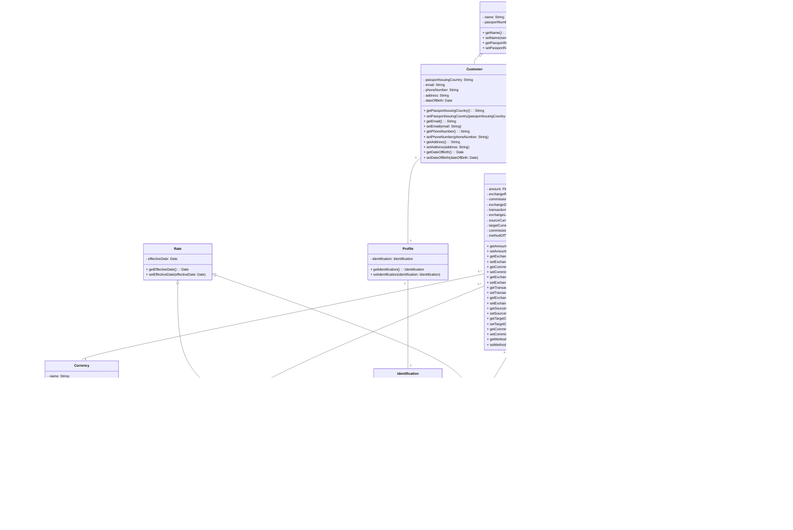

```mermaid
classDiagram
    class Person {
        - name: String
        - passportNumber: String
        + getName(): String
        + setName(name: String)
        + getPassportNumber(): String
        + setPassportNumber(passportNumber: String)
    }

    class Customer {
        - passportIssuingCountry: String
        - email: String
        - phoneNumber: String
        - address: String
        - dateOfBirth: Date
        + getPassportIssuingCountry(): String
        + setPassportIssuingCountry(passportIssuingCountry: String)
        + getEmail(): String
        + setEmail(email: String)
        + getPhoneNumber(): String
        + setPhoneNumber(phoneNumber: String)
        + getAddress(): String
        + setAddress(address: String)
        + getDateOfBirth(): Date
        + setDateOfBirth(dateOfBirth: Date)
    }

    class PersonalInfo {
        - country: String
        + getCountry(): String
        + setCountry(country: String)
    }

    class Profile {
        - identification: Identification
        + getIdentification(): Identification
        + setIdentification(identification: Identification)
    }

    class Identification {
        - idNumber: String
        - issueDate: Date
        - expiryDate: Date
        + getIdNumber(): String
        + setIdNumber(idNumber: String)
        + getIssueDate(): Date
        + setIssueDate(issueDate: Date)
        + getExpiryDate(): Date
        + setExpiryDate(expiryDate: Date)
    }

    class Passport {
        - issuingCountry: String
        + getIssuingCountry(): String
        + setIssuingCountry(issuingCountry: String)
    }

    class DrivingLicense {
        - issuingState: String
        - licenseClass: String
        + getIssuingState(): String
        + setIssuingState(issuingState: String)
        + getLicenseClass(): String
        + setLicenseClass(licenseClass: String)
    }

    class NationalID {
        - issuingAuthority: String
        + getIssuingAuthority(): String
        + setIssuingAuthority(issuingAuthority: String)
    }

    class CurrencyExchange {
        - amount: Float
        - exchangeRate: Float
        - commission: Float
        - exchangeDateTime: DateTime
        - transactionId: String
        - exchangeLocation: ExchangeLocation
        - sourceCurrency: Currency
        - targetCurrency: Currency
        - commissionRate: Float
        - methodOfTransaction: String
        + getAmount(): Float
        + setAmount(amount: Float)
        + getExchangeRate(): Float
        + setExchangeRate(exchangeRate: Float)
        + getCommission(): Float
        + setCommission(commission: Float)
        + getExchangeDateTime(): DateTime
        + setExchangeDateTime(exchangeDateTime: DateTime)
        + getTransactionId(): String
        + setTransactionId(transactionId: String)
        + getExchangeLocation(): ExchangeLocation
        + setExchangeLocation(exchangeLocation: ExchangeLocation)
        + getSourceCurrency(): Currency
        + setSourceCurrency(sourceCurrency: Currency)
        + getTargetCurrency(): Currency
        + setTargetCurrency(targetCurrency: Currency)
        + getCommissionRate(): Float
        + setCommissionRate(commissionRate: Float)
        + getMethodOfTransaction(): String
        + setMethodOfTransaction(methodOfTransaction: String)
    }

    class Currency {
        - name: String
        - symbol: String
        - isoCode: String
        - decimalPlaces: Int
        + getName(): String
        + setName(name: String)
        + getSymbol(): String
        + setSymbol(symbol: String)
        + getIsoCode(): String
        + setIsoCode(isoCode: String)
        + getDecimalPlaces(): Int
        + setDecimalPlaces(decimalPlaces: Int)
    }

    class Rate {
        - effectiveDate: Date
        + getEffectiveDate(): Date
        + setEffectiveDate(effectiveDate: Date)
    }

    class ExchangeRate {
        - rate: Float
        + getRate(): Float
        + setRate(rate: Float)
    }

    class CommissionRate {
        - rate: Float
        + getRate(): Float
        + setRate(rate: Float)
    }

    class ExchangeRateArchive {
        - historicalRates: List<ExchangeRate>
        + getHistoricalRates(): List<ExchangeRate>
        + setHistoricalRates(historicalRates: List<ExchangeRate>)
    }

    class ExchangeRateHistory {
        - currency: Currency
        - exchangeRate: Float
        - timestamp: DateTime
        + getCurrency(): Currency
        + setCurrency(currency: Currency)
        + getExchangeRate(): Float
        + setExchangeRate(exchangeRate: Float)
        + getTimestamp(): DateTime
        + setTimestamp(timestamp: DateTime)
    }

    class Statistics {
        - exchangeAmountByCountry: Map<Country, Float>
        - transactionCountByCountry: Map<Country, Int>
        + getExchangeAmountByCountry(): Map<Country, Float>
        + setExchangeAmountByCountry(exchangeAmountByCountry: Map<Country, Float>)
        + getTransactionCountByCountry(): Map<Country, Int>
        + setTransactionCountByCountry(transactionCountByCountry: Map<Country, Int>)
    }

    class DailyStatistics {
        - date: Date
        + getDate(): Date
        + setDate(date: Date)
    }

    class MonthlyStatistics {
        - month: Int
        - year: Int
        + getMonth(): Int
        + setMonth(month: Int)
        + getYear(): Int
        + setYear(year: Int)
    }

    class Country {
        - name: String
        - alpha2Code: String
        - alpha3Code: String
        - region: String
        + getName(): String
        + setName(name: String)
        + getAlpha2Code(): String
        + setAlpha2Code(alpha2Code: String)
    }

    Person <|-- Customer
    Person <|-- PersonalInfo
    Rate <|-- ExchangeRate
    Rate <|-- CommissionRate
    Statistics <|-- DailyStatistics
    Statistics <|-- MonthlyStatistics
    Identification <|-- Passport
    Identification <|-- DrivingLicense
    Identification <|-- NationalID
    
    Customer "1" -- "1..*" CurrencyExchange
    CurrencyExchange "1..*" -- "2" Currency
    CurrencyExchange "1..*" -- "1" ExchangeRate
    CurrencyExchange "1..*" -- "1" CommissionRate
    CurrencyExchange "1..*" -- "1" ExchangeLocation
    CurrencyExchange "1" -- "1" Transaction
    Currency "1..*" -- "1" Country
    ExchangeRate "1..*" -- "1" ExchangeRateArchive
    CurrencyExchange "1..*" -- "1" DailyStatistics
    CurrencyExchange "1..*" -- "1" MonthlyStatistics
    Currency "1" -- "1..*" ExchangeRateHistory
    Profile "1" -- "1" Identification
    Customer "1" -- "1" Profile
```