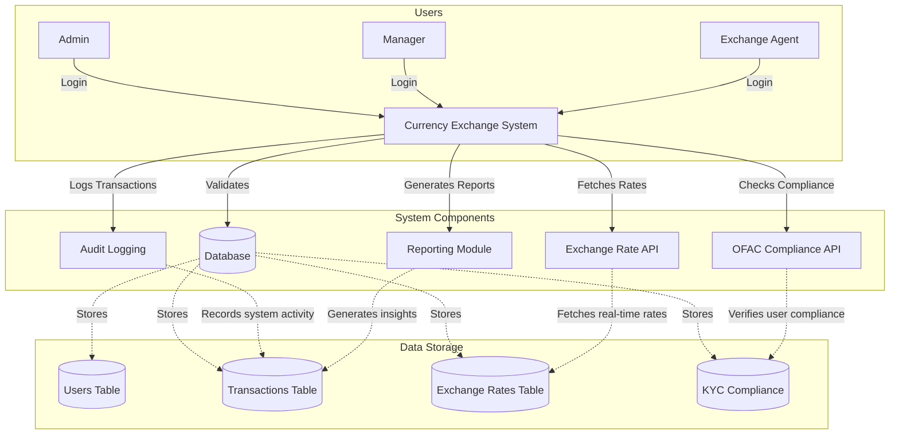

```mermaid
graph TD;
    
    subgraph Users
        A[Admin] -->|Login| S[System]
        B[Manager] -->|Login| S
        C[Exchange Agent] -->|Login| S
    end

    subgraph System Components
        S[Currency Exchange System] -->|Validates| DB[(Database)]
        S -->|Fetches Rates| API[Exchange Rate API]
        S -->|Checks Compliance| OFAC[OFAC Compliance API]
        S -->|Logs Transactions| LOGS[Audit Logging]
        S -->|Generates Reports| REP[Reporting Module]
    end

    subgraph Data Storage
        DB -.->|Stores| UsersTable[(Users Table)]
        DB -.->|Stores| TransactionsTable[(Transactions Table)]
        DB -.->|Stores| RatesTable[(Exchange Rates Table)]
        DB -.->|Stores| ComplianceTable[(KYC Compliance)]
    end

    API -.->|Fetches real-time rates| RatesTable
    OFAC -.->|Verifies user compliance| ComplianceTable
    LOGS -.->|Records system activity| TransactionsTable
    REP -.->|Generates insights| TransactionsTable
```